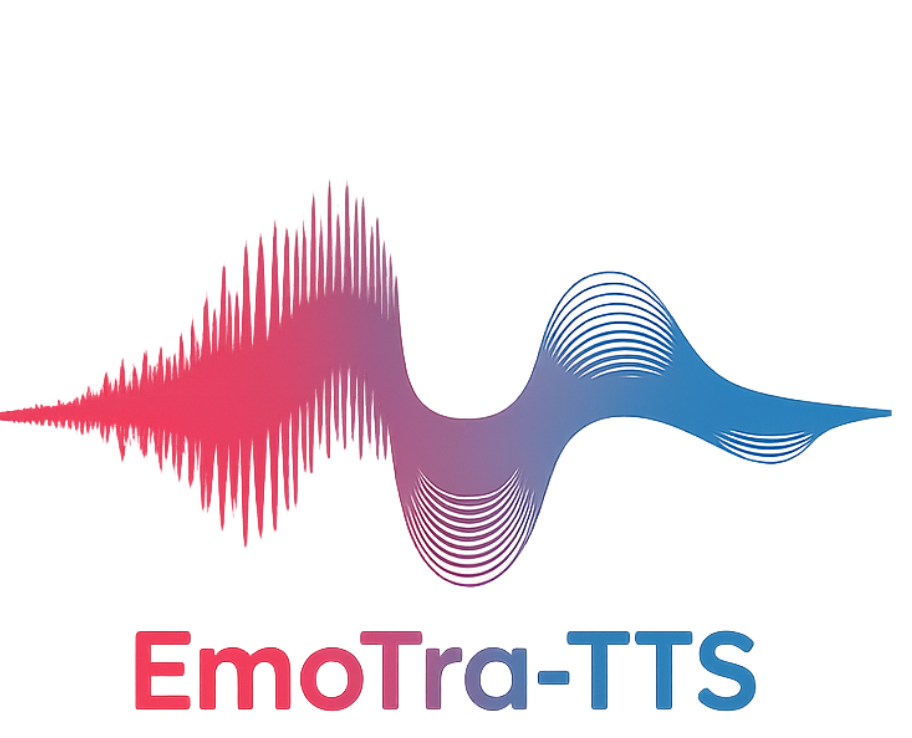

<p align="center">
  
</p>

<h1 align="center">EmoTra-TTS — Emotion Transition for Text-to-Speech</h1>

<p align="center">
  Official release for the <b>EMNLP 2026</b> accepted paper<br>
  <i>EmoTra-TTS: Smooth Intra-Utterance Emotion Transitions for Speech Synthesis</i>
</p>

<p align="center">
  🎧 <a href="https://github.com/Liu-Tianchi/EmoTra_DemoPage"><b>Demo Page</b></a>
</p>

EmoTra-TTS (Emotion Transition) is a two-stage fine-tuning framework built on [CosyVoice2](https://github.com/FunAudioLLM/CosyVoice) that enables **continuous emotion control** in speech synthesis using Valence-Arousal-Dominance (VAD) representations.

Instead of discrete emotion labels, EmoTra-TTS uses 3D VAD vectors to specify the **start** and **end** emotional states, and synthesizes speech that smoothly transitions between them.

> **Patent Notice:** The core method of EmoTra-TTS has been submitted for patent protection.
> Please see the [License](#license) section for details.

## Architecture

EmoTra-TTS adds emotion conditioning to CosyVoice 2 via two-stage supervised fine-tuning:

| Stage                        | Module                               | Base Class                   | What it learns                                                                                                                                                                    |
| ---------------------------- | ------------------------------------ | ---------------------------- | --------------------------------------------------------------------------------------------------------------------------------------------------------------------------------- |
| **Stage I: sft_LLM**   | LLM with VAD conditioning            | `Qwen2LM`                  | 5 VAD tokens (uniform alpha interpolation from start→end emotion) injected into the LM input sequence                                                                            |
| **Stage II: sft_Flow** | Flow Matching with emotion injection | `CausalMaskedDiffWithXvec` | **Direction-Magnitude Decoupled** emotion injection — MLP learns the *direction*, LayerNorm + fixed_scale set the *magnitude* (~280K trainable params, decoder frozen) |

> **Naming note.** In the code and file names this method carries the internal codename `sft_Flow_Lynorm_fixs` (**L**ayer**norm** + **fix**ed **s**cale); it refers to exactly the Direction-Magnitude Decoupled method in our paper.

## Installation

### Prerequisites

- Linux (tested on Ubuntu)
- NVIDIA GPU(s) with CUDA support
- Conda package manager

### Get the Code

This repository does **not** redistribute third-party code. The `third_party/`
directory ships empty (aside from the [Matcha-TTS](https://github.com/shivammehta25/Matcha-TTS)
submodule pointer); every external dependency is fetched from its original upstream,
under its own license, by a setup script.

Clone the repository (with the Matcha-TTS submodule):

```bash
git clone --recurse-submodules https://github.com/Liu-Tianchi/EmoTra-TTS.git
cd EmoTra-TTS
# already cloned without submodules? one line pulls it in:
git submodule update --init --recursive
```

Then fetch the remaining third-party dependencies (Matcha-TTS submodule, plus the
UniSpeech / s3prl / WavLM components used for SIM evaluation):

```bash
bash scripts/setup_third_party.sh
```

> You only need the evaluation dependencies if you plan to run SIM evaluation. The
> w2v2-vad model used by Step 1 downloads itself automatically on first use.

### Environment Setup

Two conda environments are required:

**1. EmoTra (main environment)** — for training and inference:

```bash
bash install_env.sh
conda activate EmoTra
```

> `install_env.sh` is a thin wrapper around `conda env create -f environment_emotra.yml`.
> It sets a pip build constraint (`constraints.txt`, `setuptools<81`) that is required to
> build `openai-whisper==20231117`. If you prefer to run `conda env create` directly, first
> `export PIP_CONSTRAINT=constraints.txt`.

**2. w2v2-vad** — for Step 1 VAD filtering only:

```bash
conda env create -f environment_w2v2_vad.yml
conda activate w2v2-vad
```

### Pretrained Models

Download the CosyVoice2-0.5B pretrained model. The `local_dir` sets where the
weights are saved — the default `pretrained_models/` lives inside the repo and
is git-ignored (models are never committed). Point it elsewhere if you prefer:

```bash
conda activate EmoTra
python -c "from modelscope import snapshot_download; snapshot_download('iic/CosyVoice2-0.5B', local_dir='pretrained_models/CosyVoice2-0.5B')"
```

## Pipeline Overview

```
Step 0: Download EmoVoice-DB dataset
   ↓
Step 1: Filter by VAD scores (uses w2v2-vad env)
   ↓
Step 3: Generate transition pairs with ASR quality check (multi-GPU)
   ↓
Stage I: Train sft_LLM (LLM fine-tuning with VAD tokens)
   ↓
Stage II: Train sft_Flow (Flow fine-tuning with Direction-Magnitude Decoupled injection)
   ↓
Inference: Synthesize speech with continuous emotion transition
```

> **Note:** Step 2 is intentionally skipped — Step 3 reads directly from Step 1 output.

## Data Preparation

### Step 0: Download EmoVoice-DB

```bash
conda activate EmoTra
python step0_download_emovoice.py
python step0_prepare_dataset.py
```

By default the dataset is saved to `data/EmoVoice-DB` inside the repo (the `data/`
directory is git-ignored, so datasets are never committed). Use `--data_dir` to
save it anywhere else:

```bash
python step0_download_emovoice.py --data_dir /path/to/datasets
python step0_prepare_dataset.py   --data_dir /path/to/datasets
```

### Step 1: Filter by VAD Scores

This step uses the `w2v2-vad` environment to predict VAD scores and keep only the
samples whose VAD falls in the expected range for their emotion label.

```bash
conda activate w2v2-vad
python step1_filter_by_vad.py
```

On the first run the w2v2-vad model (1 GB) is automatically downloaded from
Zenodo to `third_party/models/w2v2-vad` (inside the repository; git-ignored, so it
is never uploaded). Inference runs on CPU (onnxruntime), so no GPU is required for
this step.

By default it reads `data/EmoVoice-DB/train.jsonl` and writes one file per speaker
to `data/filtered/<speaker>_filtered.jsonl` (speakers are auto-detected from the
sample keys), plus `data/filtered/filtering_stats.json`.

Useful options:

```bash
# Quick test on 500 randomly sampled utterances
python step1_filter_by_vad.py --debug-limit 500

# Custom input / output locations
python step1_filter_by_vad.py \
    --jsonl data/EmoVoice-DB/train.jsonl \
    --audio-dir data/EmoVoice-DB/audio \
    --output-dir data/filtered
```

### Step 2: Generate Transition Data with ASR Check

Multi-GPU parallel processing with Whisper-based ASR quality verification:

```bash
conda activate EmoTra
python step2_generate_transition_data_w_ASR_check.py \
    --input-jsonl data/filtered/sage_filtered.jsonl \
    --output-dir data/transition_data_asr/sage \
    --model-path pretrained_models/CosyVoice2-0.5B \
    --gpu-ids 0,1,2,3,4,5,6,7 \
    --num-pairs 50000 \
    --language en
```

This step is GPU-heavy (CosyVoice2 synthesis + Whisper ASR). It launches one
worker process per GPU listed in `--gpu-ids`, so set `--gpu-ids` to match the
GPUs available to the job (e.g. `--gpu-ids 0,1` for 2 GPUs). Use more GPUs to
speed it up.

On first run, each worker loads the Whisper `large-v3` model (~2.9 GB). To avoid
all workers downloading it simultaneously, pre-fetch it once into the shared
cache (`~/.cache/whisper`) before launching:

```bash
conda activate EmoTra
python -c "import whisper; whisper.load_model('large-v3')"
```

Output: `data/transition_data_asr/sage/transition_data_asr_filtered.jsonl`

> **Speaker choice.** EmoVoice-DB ships two speakers: `sage` (female, the default
> used throughout these examples) and `ash` (male). To build the male voice
> instead, replace every `sage` with `ash` — in the `--input-jsonl` /
> `--output-dir` above and in the training scripts (`dataset_name`,
> `neutral_audio`, and the matching `step3_output_dir`). Both speakers are fully
> supported.

## Training

All training scripts are in `examples/libritts/cosyvoice2/`.

```bash
cd examples/libritts/cosyvoice2
```

### Stage I: Train sft_LLM

Fine-tunes the LLM to accept 5 VAD tokens (uniform alpha: 0.0, 0.25, 0.5, 0.75, 1.0) representing the emotion trajectory from start to end.

```bash
# Stages 1-4: Data preparation (JSONL → Kaldi → embeddings → tokens → parquet)
bash run_EmoTra_sft_LLM.sh  # set stage=1, stop_stage=4

# Stage 5: Train LLM
bash run_EmoTra_sft_LLM.sh  # set stage=5, stop_stage=5
```

Key hyperparameters in the script:

- `hidden_loss_weight=0.1` — weight for hidden state reconstruction loss
- `num_vad_tokens=5` — number of interpolated VAD tokens
- `vad_change_threshold=0.35` — minimum VAD change to qualify as a transition pair

Checkpoints are saved per epoch as `epoch_N_whole.pt` under
`exp/cosyvoice2_EmoTra_sft_LLM/llm/torch_ddp/<run_name>/`.

**Selecting a checkpoint.** The log reports validation `loss` and `acc` per epoch, but
these objective metrics don't always reflect perceived quality. Synthesize a few utterances with your top candidates and **listen** before deciding.

### Stage II: Train sft_Flow

Fine-tunes only the **Direction-Magnitude Decoupled** emotion injection module (MLP + LayerNorm + fixed_scale, ~280K params) while keeping the Flow decoder frozen.

**Prerequisite:** Stage I must be completed (the sft_LLM checkpoint is needed).

```bash
# Stages 1-3: Extract neutral embedding → pre-compute LLM tokens → train Flow
bash run_EmoTra_sft_Flow_Lynorm_fixs.sh  # set stage=1, stop_stage=3
```

Like the sft_LLM script, options are configured by editing variables at the top of the
script rather than CLI flags. Before running, set at least:

- `llm_checkpoint` — the sft_LLM checkpoint you selected in Stage I
- `dataset_name` — speaker/dataset tag (must match your Stage I data dir; `sage` = female, `ash` = male)
- `neutral_audio` — a neutral-emotion reference clip for that speaker

### TensorBoard

```bash
# Stage I
tensorboard --logdir=tensorboard/cosyvoice2_EmoTra_sft_LLM --port=6006 --bind_all

# Stage II
tensorboard --logdir=tensorboard/cosyvoice2_EmoTra_sft_Flow_Lynorm_fixs --port=6015 --bind_all
```

## Inference

### Single Utterance

The script ships with a built-in default text, VAD start/end, and `emo_scale`, so you can run it with no arguments:

```bash
python simple_inference_EmoTra_TTS.py
```

To override any of them (the values below are the defaults):

```bash
python simple_inference_EmoTra_TTS.py \
    --text "The weather was so bad that day, and I was sadly walking home when I suddenly saw something that made me extremely angry" \
    --vad_start 0.25,0.27,0.31 \
    --vad_end 0.20,0.85,0.86 \
    --emo_scale 0.07
```

Where:

- `--text` — text to synthesize (a default sentence is built into the script)
- `--vad_start V,A,D` — starting emotion (Valence, Arousal, Dominance), range [0, 1]
- `--vad_end V,A,D` — ending emotion
- `--emo_scale` — emotion injection strength (default: 0.07)

## Evaluation

### ASR (content consistency)

Runs in the `EmoTra` env (uses Whisper + jiwer). Provide ground-truth text to
get WER/CER; without it the script only transcribes.

> **Note:** Whisper decodes audio via `ffmpeg`, so the `ffmpeg` binary must be on
> your `PATH`. If it is missing, install it (e.g. `conda install -n EmoTra -c conda-forge ffmpeg`).

```bash
conda activate EmoTra
python eval_asr_folder.py \
    --audio-dir <output_dir> \
    --text-jsonl <ground_truth.jsonl> \
    --language en
```

### Speaker Similarity (SIM)

SIM uses a WavLM-large speaker-verification model (ECAPA-TDNN head) from
[microsoft/UniSpeech](https://github.com/microsoft/UniSpeech), and runs in a separate
`sim` conda env. None of that third-party code is redistributed here — it is fetched
from upstream by `scripts/setup_third_party.sh` (the UniSpeech source is used as-is;
our loader neutralizes its optional `fairseq` import in memory, so no on-disk patch is
applied). Set it up once:

```bash
# 1. Create the sim env (CPU build shown; swap the index-url for a CUDA build to use GPU)
conda create -n sim python=3.10 -y
conda run -n sim pip install torch torchaudio --index-url https://download.pytorch.org/whl/cpu
conda run -n sim pip install librosa soundfile numpy gdown

# 2. Fetch the third-party SIM dependencies (UniSpeech source, s3prl WavLM source,
#    and the ~1.3 GB WavLM-large SV checkpoint). Everything lands in git-ignored paths.
conda run -n sim bash scripts/setup_third_party.sh
```

First generate the multi-reference speaker embedding once, from a pool of reference audios. This averages the speaker-verification embeddings of `--num-refs` randomly sampled references into a single, emotion-neutral speaker centroid used as the similarity target:

```bash
# Generate the mean reference embedding (run once, before evaluation)
conda run -n sim python tools/precompute_ref_embedding.py --num-refs 200 --gpu 0
# => pretrained_models/CosyVoice2-0.5B/ref_embedding_sage.pt
```

Then run the evaluation:

```bash
conda run -n sim python eval_sim_folder_multiref.py \
    --audio-dir <output_dir>
```

## Project Structure

```
EmoTra_TTS/
├── step0_download_emovoice.py          # Download EmoVoice-DB dataset
├── step0_prepare_dataset.py            # Prepare dataset structure
├── step1_filter_by_vad.py              # Filter audio by VAD scores (w2v2-vad env)
├── step2_generate_transition_data_w_ASR_check.py  # Generate transition pairs
│
├── simple_inference_EmoTra_TTS.py  # Main inference script
├── eval_asr_folder.py                  # ASR evaluation
├── eval_sim_folder_multiref.py         # Multi-reference speaker similarity evaluation
│
├── environment_emotra.yml              # Conda env: EmoTra (training & inference)
├── environment_w2v2_vad.yml            # Conda env: w2v2-vad (Step 1 only)
├── requirements.txt                    # pip dependencies
│
├── cosyvoice/                          # Core model code
│   ├── bin/
│   │   ├── train.py                    # Base training entry (modified: +override arg)
│   │   └── train_sft_Flow_Lynorm_fixs.py  # Flow SFT training entry
│   ├── cli/
│   │   ├── cosyvoice.py                # CosyVoice/CosyVoice2 interface (modified)
│   │   ├── frontend.py                 # Text frontend
│   │   └── model.py                    # Base model
│   ├── dataset/
│   │   ├── processor.py                # Base data processor
│   │   ├── processor_EmoTra_sft_LLM.py  # LLM SFT data processor
│   │   └── processor_sft_Flow_Lynorm_fixs.py  # Flow SFT data processor
│   ├── flow/
│   │   ├── flow.py                     # Base Flow (CausalMaskedDiffWithXvec)
│   │   ├── flow_sft_Flow_Lynorm_fixs.py  # Flow with Direction-Magnitude Decoupled emotion injection
│   │   ├── flow_matching.py            # Base CFM (modified: +clamp fix)
│   │   ├── flow_matching_sft_Flow.py   # CFM with 3D spks support
│   │   ├── decoder.py                  # Base decoder
│   │   └── decoder_sft_Flow.py         # Decoder with 3D spks support
│   ├── llm/
│   │   ├── llm.py                      # Base LLM (Qwen2LM)
│   │   └── llm_EmoTra_sft_LLM.py # LLM with VAD token conditioning
│   ├── transformer/
│   │   └── label_smoothing_loss_safe.py  # Safe loss (prevents div-by-zero)
│   └── utils/
│       ├── executor.py                 # Base executor
│       └── executor_sft_Flow.py        # Flow SFT executor (robust DDP)
│
├── tools/
│   ├── vad_wrapper.py                   # Our wrapper around the w2v2-vad ONNX model (Step 1)
│   ├── precompute_ref_embedding.py      # Build the mean reference embedding for SIM eval
│   ├── extract_neutral_embedding.py    # Extract neutral speaker embedding
│   ├── make_parquet_list_EmoTra_sft_LLM.py  # Generate parquet for LLM SFT
│   └── precompute_llm_tokens_sft_LLM.py  # Pre-compute LLM tokens for Flow SFT
│
├── examples/libritts/cosyvoice2/
│   ├── run_EmoTra_sft_LLM.sh     # Stage I training pipeline
│   ├── run_EmoTra_sft_Flow_Lynorm_fixs.sh  # Stage II training pipeline
│   ├── conf/
│   │   ├── cosyvoice2_EmoTra_sft_LLM.yaml  # Stage I config
│   │   └── cosyvoice2_EmoTra_sft_Flow_Lynorm_fixs.yaml  # Stage II config
│   └── local/
│       └── prepare_transition_data_EmoTra_sft_LLM_fast.py  # JSONL→Kaldi
│
├── scripts/
│   └── setup_third_party.sh            # Fetch all third-party deps from upstream
│
├── third_party/                       # NOT redistributed — populated by scripts/setup_third_party.sh
│   └── Matcha-TTS/                     # Flow matching dependency (submodule pointer only)
│                                       # (UniSpeech / s3prl / WavLM ckpt fetched at setup, git-ignored)
│
└── pretrained_models/ → (symlink)      # CosyVoice2-0.5B pretrained weights
```

## License

EmoTra-TTS is released under the [Apache License 2.0](https://www.apache.org/licenses/LICENSE-2.0). See the [`LICENSE`](LICENSE) file for the full terms and third-party attributions.

- **EmoTra-TTS code:** Copyright (c) 2026 LightSpeed (Author: Tianchi Liu), licensed under Apache-2.0.
- **Files derived from [CosyVoice 2](https://github.com/FunAudioLLM/CosyVoice):** Built upon CosyVoice (Apache-2.0); all upstream Apache-2.0 obligations remain in effect, with additional modifications by Tianchi Liu.
- **Third-party components:** This repository does not redistribute third-party code — it only documents how to obtain and use each dependency. Every third-party component remains under its own original license, and users are responsible for complying with those licenses.

## Acknowledgements

EmoTra-TTS is built on top of [CosyVoice](https://github.com/FunAudioLLM/CosyVoice) by Alibaba Group. We gratefully acknowledge the CosyVoice team for making their excellent TTS framework available under the Apache 2.0 license.

## Citation

If you use CosyVoice as the base framework, please cite:

```bibtex
@article{cosyvoice2,
  title={Cosyvoice 2: Scalable streaming speech synthesis with large language models},
  author={Du, Zhihao and Wang, Yuxuan and Chen, Qian and Shi, Xian and Lv, Xiang and Zhao, Tianyu and Gao, Zhifu and Yang, Yexin and Gao, Changfeng and Wang, Hui and others},
  journal={arXiv preprint arXiv:2412.10117},
  year={2024}
}
```
